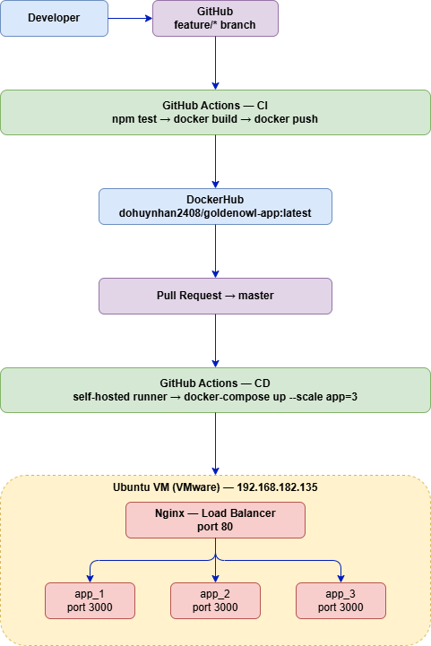

# Golden Owl DevOps Internship Challenge

## Overview

This repository contains my solution for the Golden Owl DevOps Internship technical test. The goal was to dockerize a Node.js application and establish a fully automated CI/CD pipeline using GitHub Actions, with load balancing and auto scaling.

## Architecture



## What I Did

### 1. Forked the Repository

Forked the original repository from `charlie-goldenowl/goldenowl-devops-internship-challenge` to my personal GitHub account.

### 2. Dockerized the Node.js Application

Created a `Dockerfile` at the root of the project using a lightweight `node:20-alpine` base image. Dependencies are installed with `npm ci --omit=dev` to keep the image size minimal.

```dockerfile
FROM node:20-alpine
WORKDIR /app
COPY src/package*.json ./
RUN npm ci --omit=dev
COPY src/ .
EXPOSE 3000
CMD ["node", "index.js"]
```

### 3. CI Pipeline — GitHub Actions

**File:** `.github/workflows/ci.yml`

The CI pipeline is automatically triggered on every push to `feature/**` branches. It runs two jobs sequentially:

- **test** — installs dependencies and runs `npm test` to verify all tests pass
- **build-and-push** — builds the Docker image and pushes to DockerHub tagged with the commit SHA


### 4. CD Pipeline — GitHub Actions with Self-hosted Runner

**File:** `.github/workflows/cd.yml`

The CD pipeline is automatically triggered when changes are merged into the `master` branch. It runs on a **self-hosted GitHub Actions runner** installed on an Ubuntu VM (VMware).

The runner was downloaded, configured and registered to this repository, then installed as a system service to run persistently:

```bash
mkdir actions-runner && cd actions-runner
curl -o actions-runner-linux-x64-2.334.0.tar.gz -L \
  https://github.com/actions/runner/releases/download/v2.334.0/actions-runner-linux-x64-2.334.0.tar.gz
tar xzf ./actions-runner-linux-x64-2.334.0.tar.gz
./config.sh --url https://github.com/anhANlaptrinh/goldenowl-devops-internship-challenge --token <TOKEN>
./run.sh
sudo ./svc.sh install && sudo ./svc.sh start
```


### 5. Load Balancer — Nginx

Created `nginx.conf` and `docker-compose.yml` to run Nginx as a reverse proxy in front of the app containers. Nginx distributes incoming traffic evenly across all running app instances.

```
User request → Nginx (port 80) → app_1 / app_2 / app_3 (port 3000)
```

### 6. Auto Scaling — Docker Compose

Used Docker Compose `--scale` flag to spin up multiple app instances. The number of replicas can be increased or decreased with a single command:

```bash
# Scale up to 3 instances
docker-compose up -d --scale app=3

# Scale down to 1 instance
docker-compose up -d --scale app=1
```

The CD pipeline automatically deploys with 3 instances on every master push.


### 7. Deployment

The application is deployed on a self-hosted Ubuntu 22.04 VM (VMware).

- **URL:** `http://192.168.182.135:80`
- **Response:** `{"message":"Welcome warriors to Golden Owl!"}`


### 8. DockerHub Registry

All Docker images are pushed to DockerHub. Each CI run produces a new image tagged with the commit SHA, and the latest tag is always updated on master merges.

- **Image:** `dohuynhan2408/goldenowl-app`
- **Registry:** https://hub.docker.com/r/dohuynhan2408/goldenowl-app


## CI/CD Flow Diagram


## Tech Stack

| Tool | Purpose |
|---|---|
| GitHub Actions | CI/CD automation |
| Docker | Containerization |
| Docker Compose | Multi-container orchestration + scaling |
| Nginx | Load balancer |
| DockerHub | Container image registry |
| VMware + Ubuntu 22.04 | Local deployment environment |
| GitHub Actions self-hosted runner | CD execution on local VM |
| Node.js 20 Alpine | Application runtime base image |

## Repository Structure

